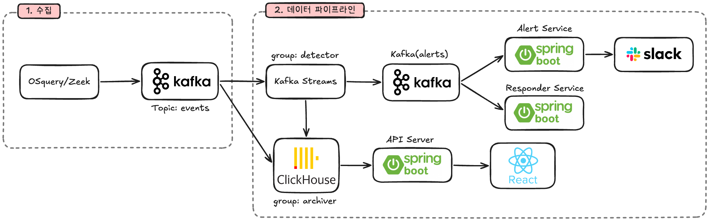

# 6. 시스템 아키텍처

## 전체 데이터 흐름

- **1. 수집**: OSquery/Zeek → Kafka(events 토픽)
- **2. 데이터 파이프라인**: Kafka에서 두 갈래로 분기
  - 탐지 갈래: Kafka Streams(group: detector) → Kafka(alerts 토픽) → Alert Service / Responder Service
  - 저장 갈래: ClickHouse(group: archiver) → API Server(Spring Boot) → React 대시보드

> **알림(Alert)과 대응(Response)은 EDR의 핵심 두 축** — 위협 판정 후 두 서비스가 나눠 처리
> - **Alert Service**: 사람에게 알린다 → Slack으로 즉시 통보 (구현)
> - **Responder Service**: 시스템이 스스로 조치한다 → 프로세스 차단·격리 등 자동 대응 (계획)

> 이 구조를 다음 슬라이드부터 **하나의 공격 이야기**로 따라가며 단계별로 설명하겠습니다.
